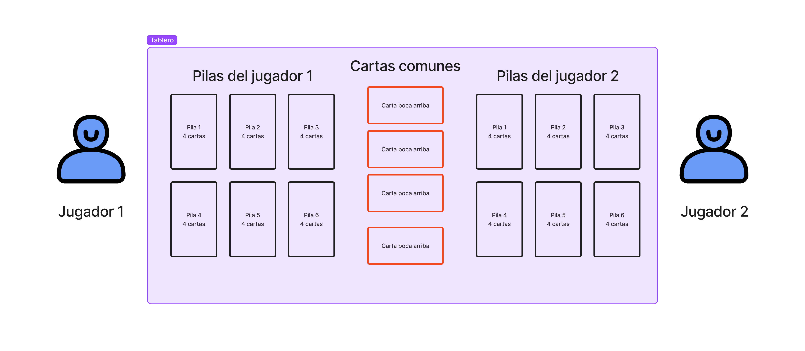

# JamesBond

## Pre-requisito de ejecución

En Windows:

- Tener instalado java. Link de descarga: <https://www.java.com/es/download/ie_manual.jsp>.
- Tener descargado el sdk de `javafx` ubicado en una dirección sin espacios, por ejemplo: `C:\` o `C:\java\`.

  Link de descarga: <https://gluonhq.com/products/javafx/>. Descarga sugerida: 

## Ejecución

Estando en la carpeta raíz del proyecto, en **`powershell`** / **`CMD`**, ejecute el siguiente comando:  
`java --module-path <JavaFX_lib_path> --add-modules javafx.controls --enable-preview -jar JamesBond.jar`, reemplazando "<JavaFX_lib_path>" por la ruta donde tiene ubicado la librería del sdk de javafx.  
Por ejemplo:  `java --module-path C:\javafx-sdk-18.0.1\lib\ --add-modules javafx.controls --enable-preview -jar JamesBond.jar`

## Rama más actualizada

Rama `main`

## Sobre el repositorio

Repositorio dedicado al desarrollo del MARDA. 2022 semestre I - Diseño de Software

## Información general del juego

Los jugadores juegan para recoger paquetes de cuatro cartas iguales intercambiando cartas de una en una con un conjunto de cuatro cartas boca arriba (las que están en la mesa).

---

### Especificaciones

- 2 jugadores.
- 52 cartas en total, de tipo estándar (sin jokers).  
- 24 cartas cada jugador.
- 4 cartas comunes en la mesa.
- Se juega por turnos con un tiempo máximo.

---

### Reglas

1. La pila que está mirando el jugador debe volver a colocarse boca abajo sobre la mesa antes de que pueda recogerla y mirar otra pila.
2. Solo se puede intercambiar una carta por turno con las 4 boca arriba del centro de la mesa.
3. Cuando un jugador tiene 4 cartas del mismo tipo en una pila, coloca su pila boca arriba.
4. Cuando un jugador tiene 4 cartas iguales en sus seis pilas debe gritar “James Bond” para ganar el juego.

---

### Repartición

Se reparten 4 cartas boca abajo intercalando jugadores, hasta formar 6 pilas para cada jugador de la siguiente forma:  

|      |      |
| :--- | :--- |
`J1` recibe 4 cartas | forma la 1ª pila
`J2` recibe 4 cartas | forma la 1ª pila
continúa consecutivamente . . .
`J1` recibe 4 cartas | forma la 6ª pila
`J2` recibe 4 cartas | forma la 6ª pila

---

### Turnos

Según el juego original, se juega de manera simultánea, no hay turnos, todos juegan tan rápido como pueden; sin embargo, el equipo adaptó los turnos para manejarlos al azar, de manera que un jugador puede tener turnos simultáneos para simular la velocidad, teniendo en cuenta el manejo de probabilidades para que no sea de forma injusta.  
Además, cada turno posee un tiempo límite para intercambiar tantas  cartas como pueda.

---

### Ilustración del juego - inicial

Puede darse una idea de la composición del jugo con la siguiente imagen:

---

**Autores:**

| Nombre                      | contacto                        |
| :---                        | :---                            |
| Fabián Orozco Chaves        | fabian.orozcochaves@ucr.ac.cr   |
| Daniel Escobar Giraldo      | daniel.escobargiraldo@ucr.ac.cr |
| Manuel Arroyo Portilla      | manuel.arroyoportilla@ucr.ac.cr |
| Wilmer Araya Rivas          | wilmer.araya@ucr.ac.cr          |
